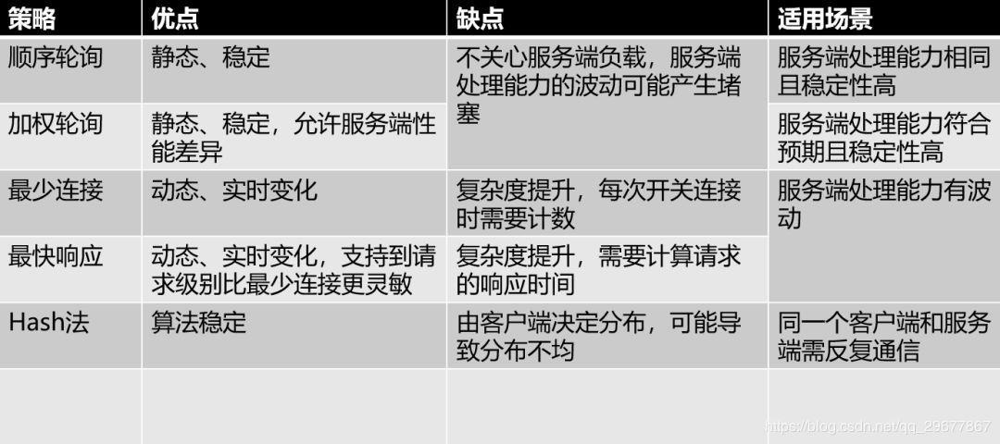
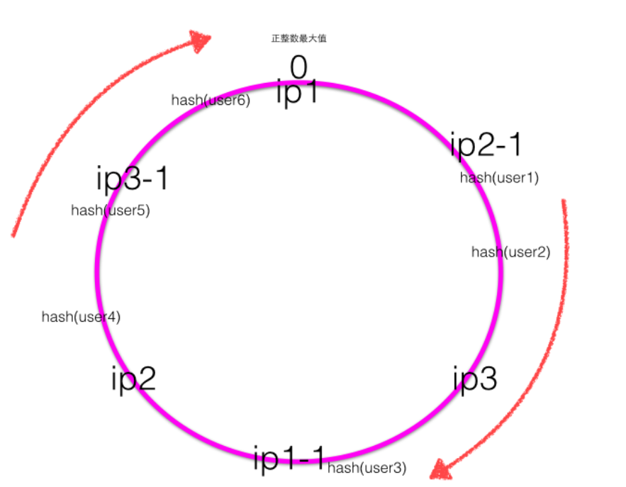

### 1 什么是分布式session问题 

在单台服务器中下，session会保存在服务端，每次用户重复访问服务器时，可以根据sessionId获取对应的session。但是在使用分布式服务器时，由于用户每次访问可能会访问到不同的服务器，那么使用老办法就有可能无法获取到session，这就是分布式session不一致问题。

解决办法：

- **session同步法：**多台web-server相互同步数据
- **客户端存储法：**一个用户只存储自己的数据
- **反向代理hash一致性：**四层hash和七层hash都可以做，保证一个用户的请求落在一台web-server上
- **后端统一存储：**web-server重启和扩容，session也不会丢失

### 2 常见的负载均衡策略

1. 轮询：平均分配，一人一次。
2. 加权轮询：为每台服务器标记一个权重（代表能力），能者多劳。
3. 最少连接数：每次分配给当前持有连接数最少的服务器。
4. 最快响应：结合加权轮询来看，最近一段时间响应速度越快的服务器，权重越大。
5. hash法：通过客户端的某个标识经过hash来决定访问哪个服务器。

### 3 一致性hash算法

在解决分布式系统中负载均衡的问题时候可以使用Hash算法让固定的一部分请求落到同一台服务器上，这样每台服务器固定处理一部分请求（并维护这些请求的信息），起到负载均衡的作用。

但是普通的余数hash（hash(比如用户id)%服务器机器数）算法伸缩性很差，当新增或者下线服务器机器时候，用户id与服务器的映射关系会大量失效。一致性hash则利用hash环对其进行了改进。

### 2  跨域问题

1. 什么是跨域问题

   由于浏览器的同源策略，处在一个域名下的客户端无法访问另一个域名下的资源。

2. 浏览器为什么要使用同源策略

   - 浏览器中保存了很多cookie，恶意网站可能通过这些cookie去访问其他网站。
   - 恶意网站通过打开其它网站的网页，欺骗用户输入用户名和密码，然后获取用户名和密码。

3. 为什么要跨域

   在前后端分离的情况下，前端和后端可能不在同一个域中。

4. 如何实现跨域

   - 只有get请求，使用JSONP
   - 对浏览器兼容性及浏览器版本无要求，CORS
   - 对浏览器兼容性及浏览器版本有要求，反向代理

